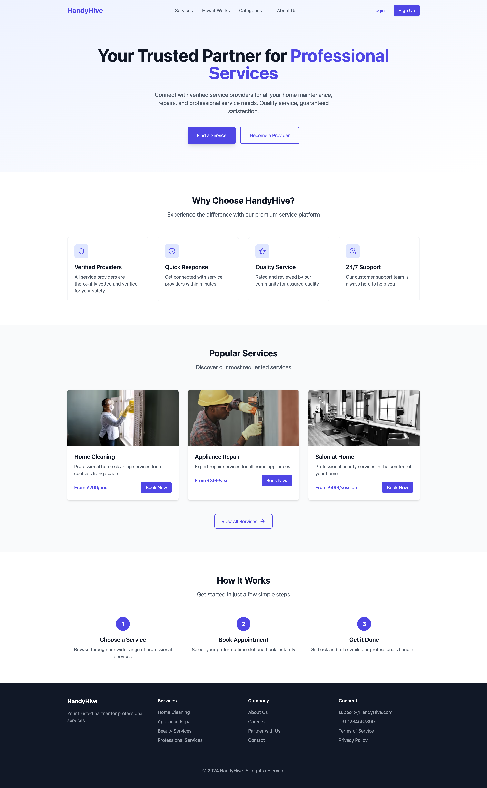
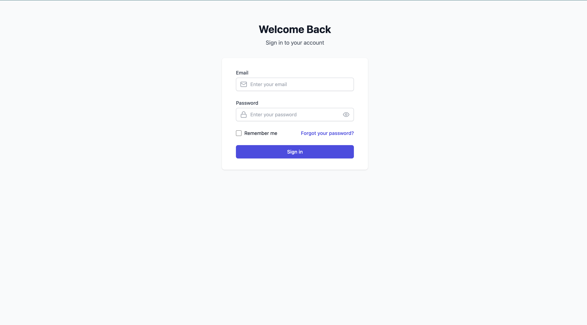
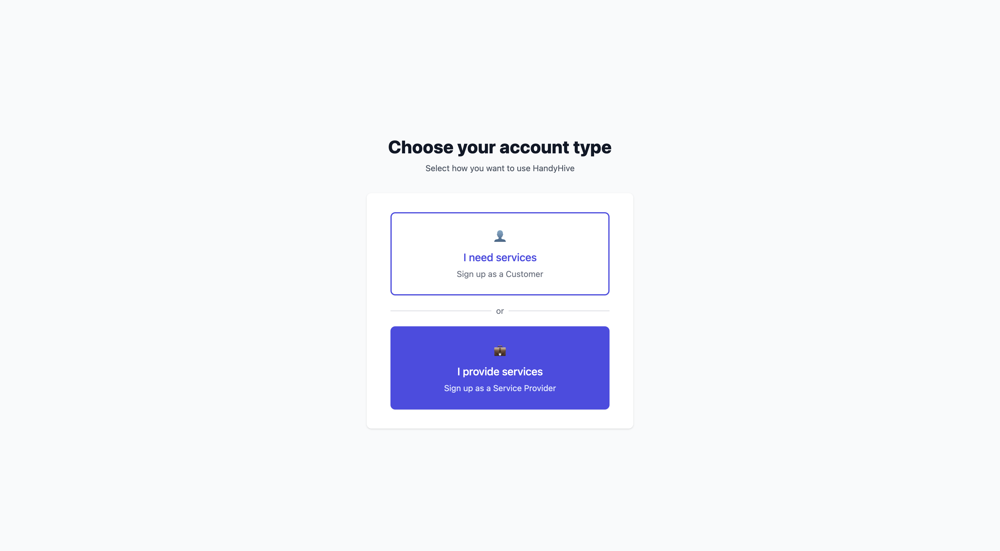
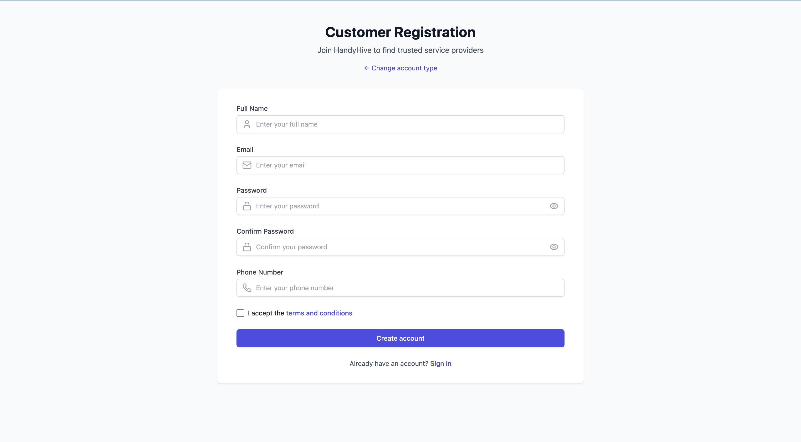
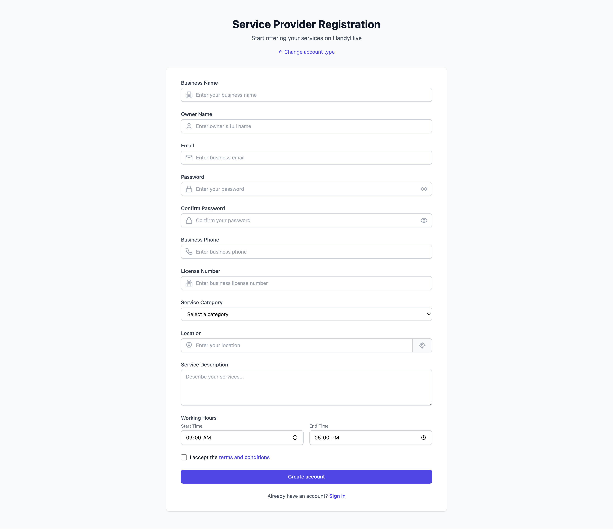
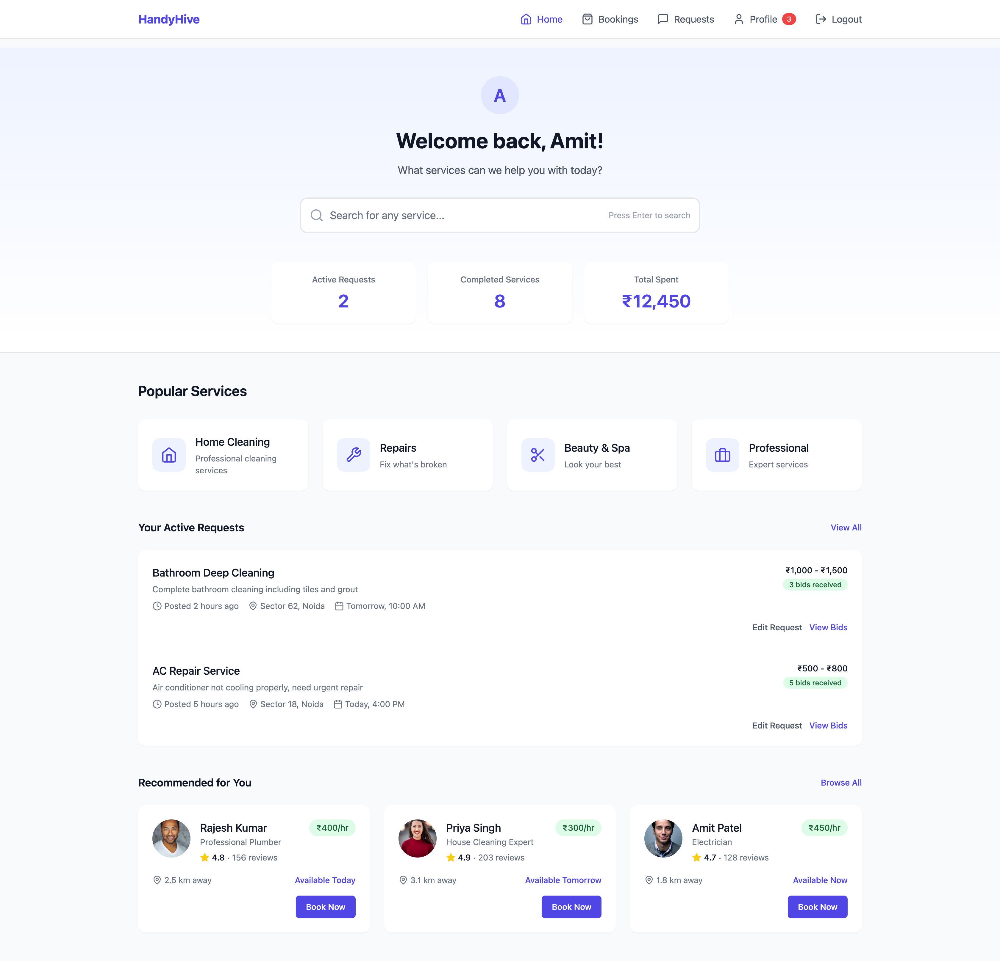
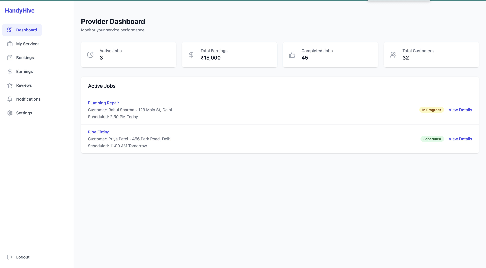
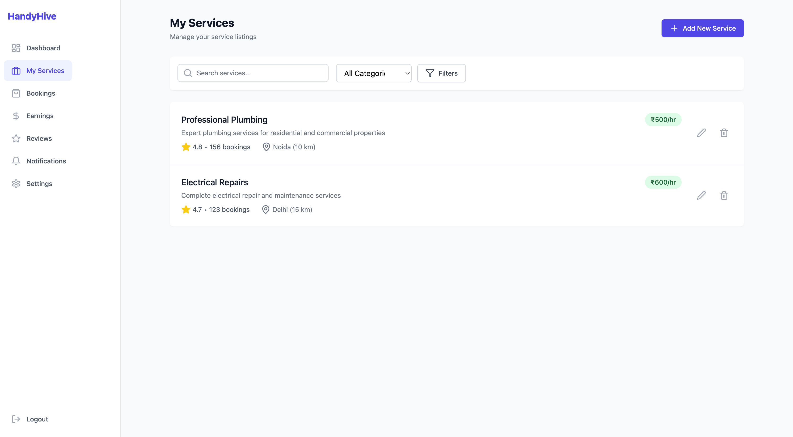
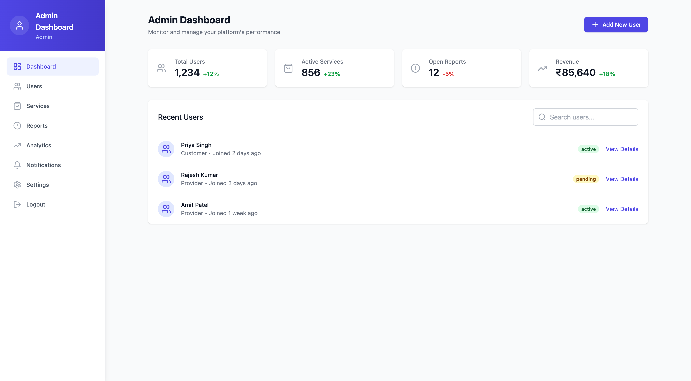
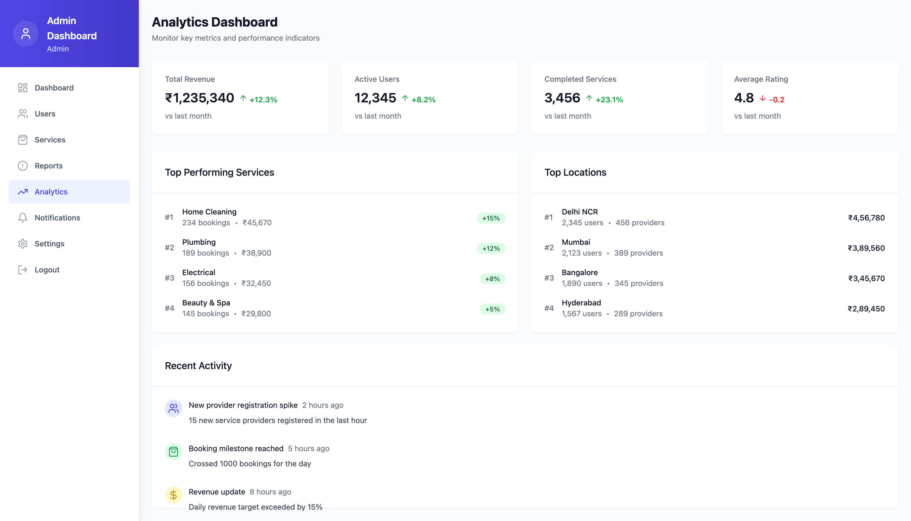

# HandyHive Multi-Vendor Service Platform

A comprehensive platform connecting customers with verified service providers for home maintenance, repairs, and professional services.


## 🌟 Features

### For Customers
- **Service Discovery**: Browse and search for various home services
- **Real-time Booking**: Instant booking with verified service providers
- **Location-based Search**: Find services near your location using Google Maps integration
- **Service Requests**: Post custom service requests and receive bids
- **Rating & Reviews**: Rate and review service providers
- **Real-time Chat**: Communicate with service providers
- **Payment Integration**: Secure payment processing
- **Booking Management**: Track and manage your service bookings

### For Service Providers
- **Profile Management**: Create and manage professional profiles
- **Service Listings**: List and manage your services
- **Booking Management**: Accept and manage customer bookings
- **Earnings Dashboard**: Track earnings and payment history
- **Customer Reviews**: Manage and respond to customer reviews
- **Real-time Notifications**: Get notified of new booking requests

### For Administrators
- **User Management**: Manage customers and service providers
- **Service Oversight**: Monitor and manage service categories
- **Analytics Dashboard**: Comprehensive platform analytics
- **Report Management**: Handle user reports and complaints
- **System Settings**: Configure platform settings

## 📱 Screenshots

### Landing Page

*Modern landing page with service categories and call-to-action*

### Authentication

*Clean login interface*


*Responsive signup form with Google Maps integration*


*Responsive signup form with Google Maps integration*


*Responsive signup form with Google Maps integration*

### Customer Dashboard

*Personalized dashboard with quick actions and service recommendations*

### Service Provider Dashboard

*Provider overview with earnings and job statistics*


*Manage service listings*


*Detailed earnings and transaction history*

### Admin Dashboard

*Comprehensive admin overview*


*Manage platform users*


*Platform analytics and insights*


## 🚀 Tech Stack

### Frontend
- **React 18** - Modern React with hooks and functional components
- **TypeScript** - Type-safe development
- **Tailwind CSS** - Utility-first CSS framework
- **React Router** - Client-side routing
- **Lucide React** - Beautiful icons
- **Socket.io Client** - Real-time communication
- **Google Maps API** - Location services and autocomplete

### Backend
- **Node.js** - JavaScript runtime
- **Express.js** - Web application framework
- **MongoDB** - NoSQL database
- **Mongoose** - MongoDB object modeling
- **Socket.io** - Real-time bidirectional communication
- **JWT** - JSON Web Token authentication
- **bcryptjs** - Password hashing
- **Multer** - File upload handling

### Development Tools
- **Vite** - Fast build tool and development server
- **ESLint** - Code linting
- **TypeScript** - Static type checking
- **Nodemon** - Development server auto-restart

## 📋 Prerequisites

Before running this project, make sure you have the following installed:

- **Node.js** (v16 or higher)
- **npm** or **yarn**
- **MongoDB** (local installation or MongoDB Atlas)
- **Google Maps API Key**

## ⚙️ Installation

1. **Clone the repository**
   ```bash
   git clone https://github.com/zetaver/handyhive-multi-vendor-service-platform.git
   cd handyhive
   ```

2. **Install dependencies**
   ```bash
   # Install frontend dependencies
   npm install
   
   # Install backend dependencies
   cd server
   npm install
   cd ..
   ```

3. **Environment Setup**
   
   Create a `.env` file in the `server` directory:
   ```env
   MONGODB_URI=mongodb://localhost:27017/handyhive
   JWT_SECRET=your_jwt_secret_key_here
   PORT=5000
   ```

4. **Google Maps API Setup**
   
   Add your Google Maps API key to `index.html`:
   ```html
   <script src="https://maps.googleapis.com/maps/api/js?key=YOUR_API_KEY&libraries=places"></script>
   ```

5. **Start the development servers**
   
   Terminal 1 (Backend):
   ```bash
   cd server
   npm run dev
   ```
   
   Terminal 2 (Frontend):
   ```bash
   npm run dev
   ```

6. **Access the application**
   - Frontend: http://localhost:5173
   - Backend API: http://localhost:5000

## 🏗️ Project Structure

```
handyhive/
├── public/                 # Static assets
├── src/                   # Frontend source code
│   ├── components/        # Reusable React components
│   ├── contexts/         # React context providers
│   ├── layouts/          # Layout components
│   ├── services/         # API service functions
│   ├── types/            # TypeScript type definitions
│   ├── utils/            # Utility functions
│   ├── views/            # Page components
│   │   ├── admin/        # Admin dashboard pages
│   │   ├── auth/         # Authentication pages
│   │   ├── customer/     # Customer dashboard pages
│   │   ├── dashboard/    # Shared dashboard components
│   │   └── provider/     # Provider dashboard pages
│   └── App.tsx           # Main application component
├── server/               # Backend source code
│   ├── config/          # Database configuration
│   ├── controllers/     # Route controllers
│   ├── middleware/      # Custom middleware
│   ├── models/          # Database models
│   ├── routes/          # API routes
│   └── index.js         # Server entry point
└── docs/                # Documentation and screenshots
```

## 🔐 Authentication

The application supports three user roles:

### Customer
- Register with basic information
- Browse and book services
- Manage bookings and payments

### Service Provider
- Register with business details and verification
- List services and manage bookings
- Track earnings and customer reviews

### Administrator
- Full platform access
- User and service management
- Analytics and reporting

## 🗄️ Database Schema

### User Model
```javascript
{
  email: String,
  password: String,
  role: ['admin', 'provider', 'customer'],
  fullName: String,
  phone: String,
  avatar: String,
  // Provider-specific fields
  businessName: String,
  serviceCategory: String,
  location: {
    type: 'Point',
    coordinates: [Number]
  },
  // ... other fields
}
```

### Service Model
```javascript
{
  title: String,
  category: ObjectId,
  description: String,
  price: Number,
  provider: ObjectId,
  location: {
    type: 'Point',
    coordinates: [Number]
  },
  status: ['active', 'inactive']
}
```

### Booking Model
```javascript
{
  service: ObjectId,
  customer: ObjectId,
  provider: ObjectId,
  status: ['pending', 'confirmed', 'completed', 'cancelled'],
  scheduledDate: Date,
  scheduledTime: String,
  price: Number,
  location: {
    address: String,
    coordinates: [Number]
  }
}
```

## 🔌 API Endpoints

### Authentication
- `POST /api/auth/register` - User registration
- `POST /api/auth/login` - User login
- `GET /api/auth/me` - Get current user
- `PATCH /api/auth/profile` - Update profile

### Services
- `GET /api/services` - Get all services
- `GET /api/services/nearby` - Get services by location
- `POST /api/services` - Create service (Provider only)
- `PUT /api/services/:id` - Update service
- `DELETE /api/services/:id` - Delete service

### Bookings
- `GET /api/bookings` - Get user bookings
- `POST /api/bookings` - Create booking
- `PATCH /api/bookings/:id/status` - Update booking status
- `POST /api/bookings/:id/review` - Add review

### Admin
- `GET /api/users` - Get all users (Admin only)
- `GET /api/reports` - Get reports (Admin only)
- `GET /api/analytics` - Get analytics (Admin only)

## 🎨 UI/UX Features

### Design System
- **Color Palette**: Indigo primary with complementary colors
- **Typography**: Clean, readable fonts with proper hierarchy
- **Spacing**: Consistent 8px grid system
- **Components**: Reusable, accessible components

### Responsive Design
- Mobile-first approach
- Breakpoints for tablet and desktop
- Touch-friendly interface elements
- Optimized navigation for all screen sizes

### Accessibility
- ARIA labels and roles
- Keyboard navigation support
- High contrast ratios
- Screen reader compatibility

## 🔄 Real-time Features

### Socket.io Integration
- Real-time chat between customers and providers
- Live booking status updates
- Instant notifications
- Typing indicators

### Chat System
- Message history
- File sharing capabilities
- Online/offline status
- Message delivery status

## 🚀 Deployment

### Frontend Deployment (Netlify/Vercel)
1. Build the project:
   ```bash
   npm run build
   ```
2. Deploy the `dist` folder to your hosting platform

### Backend Deployment (Heroku/Railway)
1. Set environment variables
2. Deploy the `server` directory
3. Ensure MongoDB connection is configured

### Environment Variables for Production
```env
NODE_ENV=production
MONGODB_URI=your_production_mongodb_uri
JWT_SECRET=your_production_jwt_secret
PORT=5000
```

## 🧪 Testing

### Running Tests
```bash
# Frontend tests
npm run test

# Backend tests
cd server
npm run test
```

### Test Coverage
- Unit tests for components
- Integration tests for API endpoints
- E2E tests for critical user flows

## 🤝 Contributing

1. Fork the repository
2. Create a feature branch (`git checkout -b feature/amazing-feature`)
3. Commit your changes (`git commit -m 'Add some amazing feature'`)
4. Push to the branch (`git push origin feature/amazing-feature`)
5. Open a Pull Request

### Development Guidelines
- Follow TypeScript best practices
- Use meaningful commit messages
- Add tests for new features
- Update documentation as needed

## 📝 License

This project is licensed under the MIT License - see the [LICENSE](LICENSE) file for details.

## 👥 Team

- **Frontend Developer** - React, TypeScript, UI/UX
- **Backend Developer** - Node.js, MongoDB, API Design
- **Full Stack Developer** - Integration, Testing, Deployment

## 📞 Support

For support and questions:
- Email: info@zetaver.com
- GitHub Issues: [Create an issue](https://github.com/yourusername/handyhive/issues)
- Documentation: [Wiki](https://github.com/yourusername/handyhive/wiki)

**Made with ❤️ by the HandyHive Team**